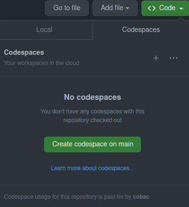
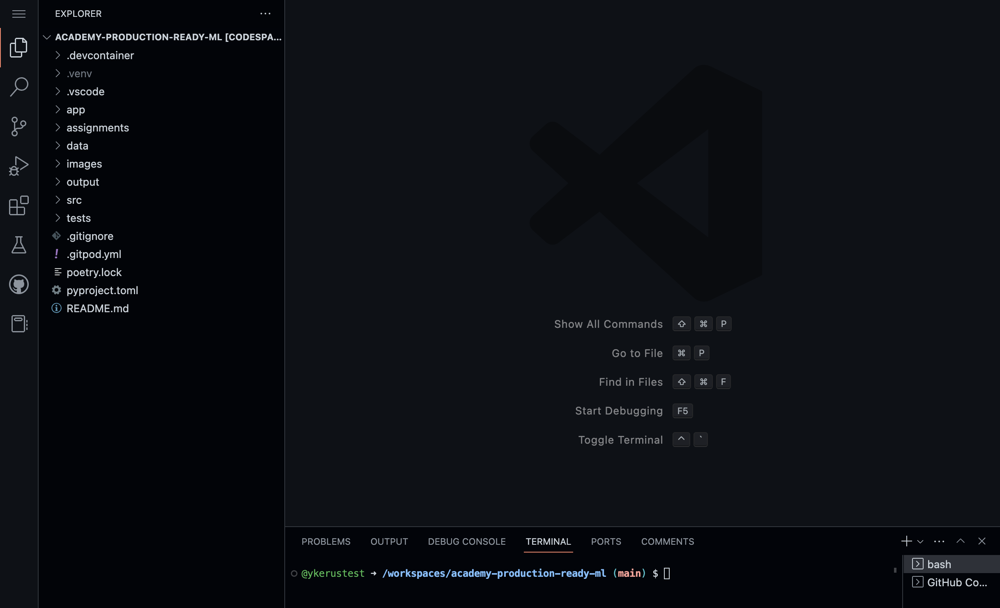
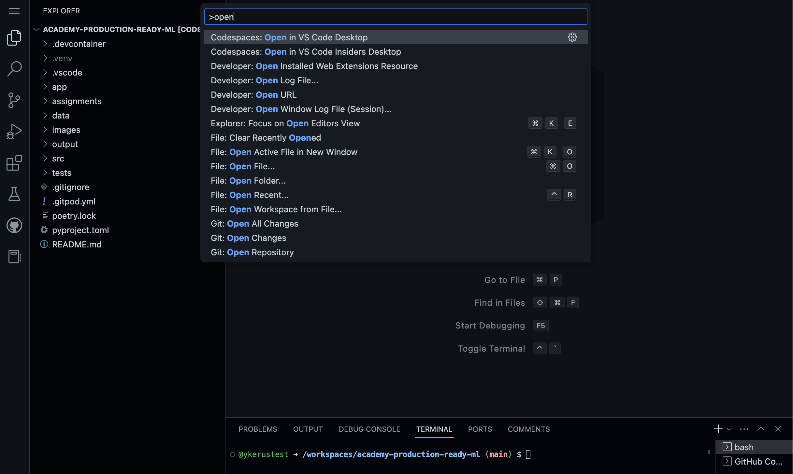
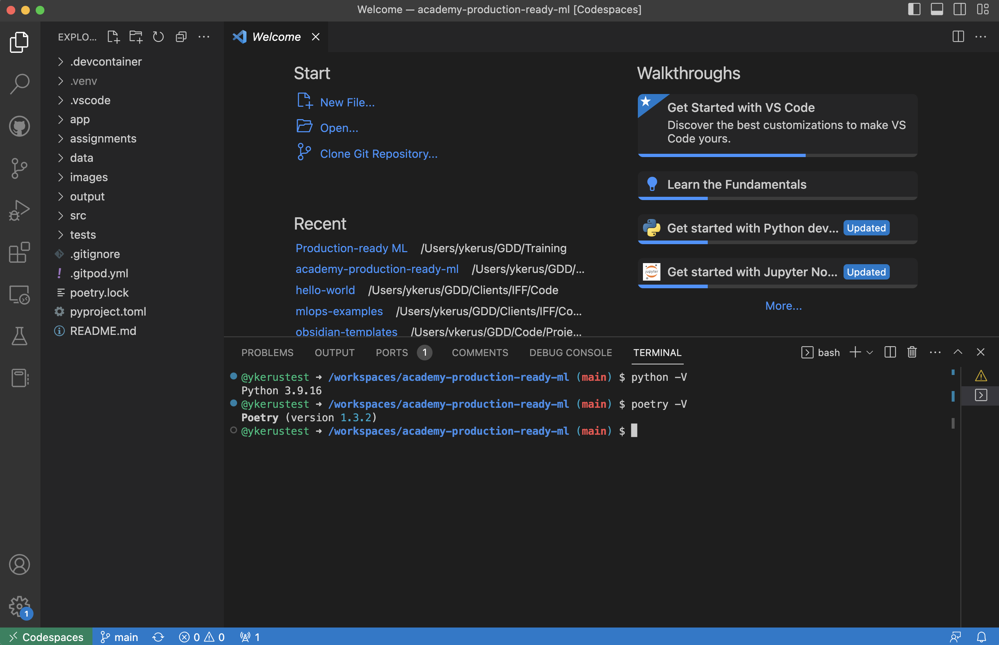
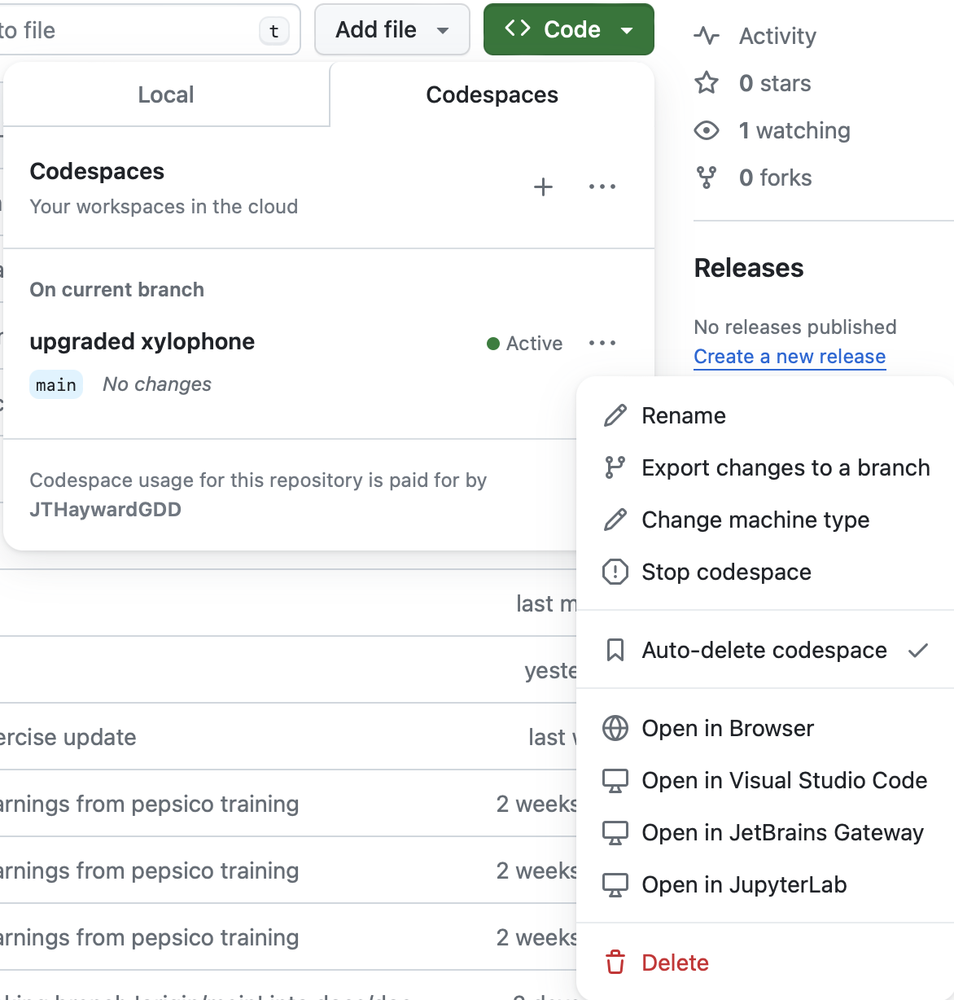

# llm-fundamentals

## Set-up

If you have a local Python installation, and you can set up Jupyter and Poetry, you will be able to follow the training using your own setup and the editor of your choice.

Alternatively, we provide a devcontainer that spins up an environment that you can use within VS Code with everything ready for the training. The steps to set this up are:

1. ✅ Access the repository
2. Open or create a codespace on the `main` branch:

3. [Codespaces](https://docs.github.com/en/codespaces/overview) allow you to work on a repository on a computer other than your own, saving you from the trouble of setting everything up yourself. After creating your codespace succesfully, you should see a VS Code interface in your browser:


4. (Optional) Access the codespace in your locally installed VS Code Desktop. To do so, open the command palette in VS Code you have opened in your browser. To open the command palette, on Mac the shortcut is `⌘+SHIFT+P`, on Windows and Linux it is `Ctrl+Shift+P`. From the command palette, select "Codespaces: Open in VS Code Desktop", and follow the steps to open VS Code locally.

5. You should now have access to the code, in your personal codespace, in your locally installed VS Code Desktop.

To make sure everything is setup correctly you can:
   - Inspect the bottom left corner, which should say "Codespaces" (may be located elsewhere in the Windows version)
   - Open a terminal in VS Code and run `python -V`, which should return a Python version >= 3.9.
   - Run `poetry -V`, which should return any version of Poetry.

6. That's it! You should be all setup now.<!-- You can close VS Code and the tabs you have opened in your browser. -->
You can delete the codespace to save your account Usage/Storage hours and start a new one during the training. -->



## Developing exercises
The exercises are generated automatically.
Please develop and make changes only in the solutions folder.
Then run the following command to generate the exercises:

```bash
poetry run invoke generate-exercises
```

This will automatically generate the exercises and copy them to the `exercises` folder.
It also automatically removes all the code between the `# START CODE HERE` and `# END CODE HERE` comments in the notebooks and python files.

If you use pre-commit, this will be run automatically before each commit.
So you don't have to worry about it.
You can add the pre-commit hook by running the following command:

```bash
poetry run pre-commit install
```

If you don't use pre-commit, the CI will fail if you forget to run this command.


